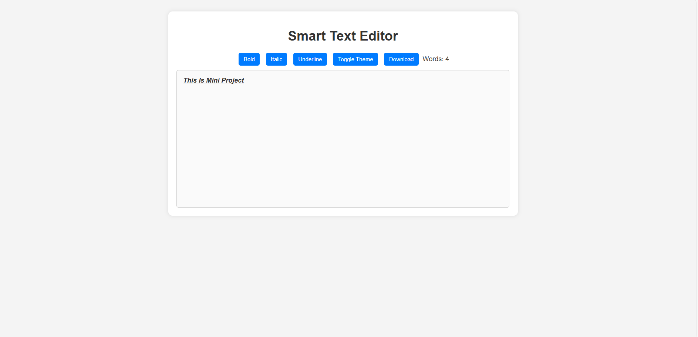

# 📝 Smart Text Editor

A lightweight, browser-based text editor with smart features like formatting, word count, dark mode, and downloadable content.

## 🚀 Features

- ✍️ Rich text editing (Bold, Italic, Underline)
- 🌙 Light/Dark theme toggle with smooth transitions
- 🔢 Real-time word counter
- 💾 Download your notes as a `.txt` file
- ⚡ Responsive and modern UI
- 🔐 No backend required — fully client-side

## 📸 Screenshots

## 🛠️ Tech Stack

- HTML5
- CSS3 (with transitions)
- Vanilla JavaScript (no frameworks)

## 📂 Project Structure

